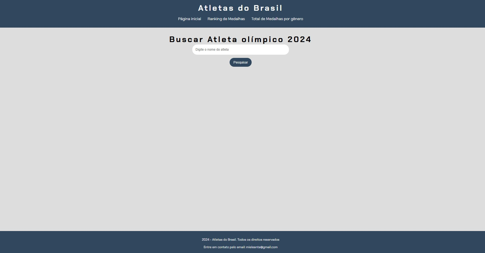
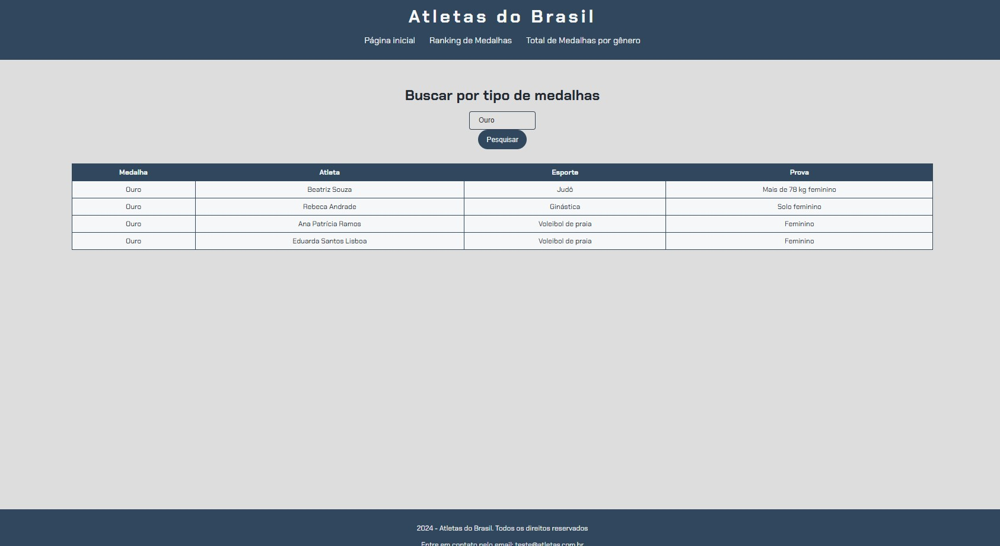

# imersao-dev-alura
 Imersão dev com Gemini

Projeto desenvolvido na  Imersão dev com Gemini, onde foi feito usando javascript com auxilio do Gemini, github para o controle de versionamento e o vercel apra deploy

## Busca por atleta

## Busca por tipo de medalha que pode ser ouro, prata ou broze

